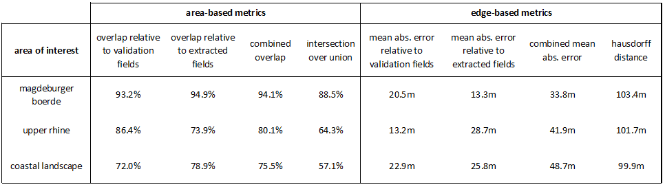
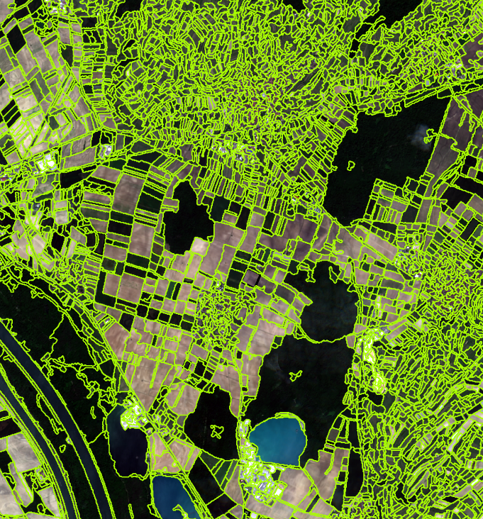

# Field boundary delineation - A knowledge-based, transferable approach for field demarcation based on Sentinel-2 imagery

## Project summary

The core idea of this project is to enable field boundary delineation by means of a small selection of training fields in a semi-automated way by providing a ready-to-use toolbox. The aim is to fill the gap between very complex, difficult to reproduce, knowledge-based single case solutions and largely automated neural network approaches that require a large number of training fields. The approach allows on the one hand a targeted control of the field delimitation process (e.g. by the training sample selection) and is on the other hand largely automated so that delimitations are possible even without complex parameter specifications. The procedure as implemented below is essentially based on the work of Watkins & van Niekerk 2019 ([paper I](https://doi.org/10.1016/j.compag.2019.02.009), [paper II](https://doi.org/10.1016/j.compag.2019.105078)) and represents an attempt to optimise it further.

  

  

## Algorithm description

    

        
        
        Some comments on the ruleset describing the workflow:
        <ul>
            <li>In the first step edge layers are calculated for every available satellite scene. The subsequent averaging reduces noise and enhances field boundaries as they are likely to be consistent throughout scenes. Normalising the derived average edge layer ensures transferability of the subsequent workflow across diffferent study areas.</li>
            <li>The second step forms the core of the workflow. Here, the creation of field objects utilising a watershed segmentation based on the averaged edge layer takes place. In order to find the optimal overflow height for parametrising the segmentation algorithm, the fields provided by the user are taken as training fields. Using an area-based overlap metric, the average (mean or median) overlap between training fields and delineated fields is evaluated for a set of overflow heights with the optimal one being finally selected.</li>
            <li>In the third step, objects smaller than 0.5ha are merged as they are likely to be caused by noise. In case they represent actual fields, they can only be delineated poorly anyway (considering the 10m resolution of Sentinel 2). An iterative multiresolution region growing approach is applied to merge small objects with neighbours being similar in terms of their spectral properties. This also allows to keep boundary objects representing, for example, streets between two fields. This is as boundary objects are likely to be merged together rather than to be merged with fields due to the object similarity. Once they reach the critical threshold of 0.5ha, they are not merged any further. The scale parameter may be modified by the user to retain other objects smaller 0.5ha, if they should not be merged with fields (e.g. wind turbines).</li>
            <li>The subsequent extraction of agricultural parcels is based on samples fed into a random forest classifier. The classifier considers spectral as well as geometrical and topological properties of the objects in order to distinguish between fields and non-agricultural objects. Regarding spectral properties temporally aggregated statistics on the NDVI (max, min and range) are used. A knowledge-based classification via expert-defined thresholds was discarded as distinctions between meadows and forests are not feasible using NDVI metrics only.</li>
            <li>The penultimate step allows the user to perform a second field boundary extraction step by creating a new level of smaller fields below the existing one. The idea is to allow to deliberate over-segmentation as this may be desirable for many usages of the final field boundary data set. For performing crop type classifications, for example, a representation of fields by multiple objects is less problematic than objects covering multiple fields. Additionally, the implementation of this step has an algorithm-related conceptual background: Selecting the optimal watershed overflow height in step (02) via optimisation of average areal overlaps is likely to introduce a bias towards under-segmentation. This bias is more pronounced when optimising the median areal overlap but may still be present even in case of mean areal coverage optimisation. This problem may be counterbalanced by introducing a second segmentation step using a different segementation technique. Specifically, a multi-resolution segmentation with large weights for shape & compactness may allow to split shapes currently covering multiple fields. Finding an optimal scale parameter for the MRS to avoid splitting too many correctly delineated fields, remains a problem though. Except for the heuristics that scale parameters increasing the number of agricultural objects by more than 5% are likely to cause undesired degrees of over-segmentation, no better way of choosing appropriate scale parameters has been found so far. Thus, this step is implemented as a optional one, which may be neglected by the user.</li>
        </ul>
        Note that in the algorithm development, alternatives to canny-based watershed segmentation were explicitly tested for their performance. Two approaches in particular were pursued but ultimately discarded due to lack of accuracy:
        <ul>
            <li>The watershed-based delineation using a combined edge layer by averaging layers created by Canny and Sigma filters. This was done under the idea that the combination of two filters in terms of an ensemble model could compensate for inaccuracies of a single filter.</li>
            <li>A multithreshold-based delineation based on line filters for edge detection. Based on the knowledge that field boundaries are mostly straight or only slightly curved, a line filter was parameterised in such a way that the proportion of correctly detected field boundaries in a buffer area of the training fields was maximised while the proportion of false positive boundaries within the fields was minimised. This approach resulted in topologically incoherent boundaries that proved difficult to use further.</li>
        </ul>
        
    

    

  

  

## Evaluation

In order to develop the algorithm and at the same time to make first evaluations of its performance, Sentinel-2 data for three different agricultural areas within Germany were used. A more detailed description of the data and the study areas can be found in the corresponding subfolder. 

### Performance

Extracting field boundaries for a study area of 100km2 takes less than 1 min of actual computation time. Including the effort to delineate a small amount of training fields upfront and selecting training samples for the classification of fields vs. non-agricultural areas the total time for running the workflow for such an area amounts to a maximum of 10 minutes (including accuracy assessment but excl. satellite data imagery download). Thus, the implemented algorithm is efficient in terms of computational resources and allows to retrieve boundaries in a timely manner. For an upscaling to larger, supra-regional to national areas of investigation, a multicore/-thread solution using eCognition Server would also be conceivable.

### Accuracy

Note that the following accuracies should be treated with caution, as the algorithm was developed on the basis of the study areas mentioned. The fields used for validation were indeed used exclusively in the final step of the accuracy assessment, but the results may be somewhat biased as the training fields of the regions were used to modify/adapt the algorithm. Nevertheless, the results give a first impression of the performance of the algorithm and especially of the varying accuracies depending on structural conditions in the study areas. As expected, very good accuracies are found for large-scale plots with a high degree of compactness and clear delineation from neighbouring cells (magdeburger boerde), whereas more complex, smaller-scale plot patterns are more difficult to delineate (upper rhine, coastal region). With regard to the second delineation step (05 in Fig. above), higher accuracies could be achieved in case of the magdeburger boerde aoi when including this process. For both of the other aois this step was discarded as it proved to be cumbersome to find an appropriate scale parameter.

The map below should give an impression of what the figures describing the averages for all validation fields within a certain aoi actually imply. All of the following figures refer to the upper rhine area (respresenting an area in which the application of the algorithm succeeded moderately well as described above). The detailed comparison of extracted vs. maunally delineated boundaries to the right is only made for two randomly selected fields and aims at providing an intuition for the meaning of the accuracy figures. Based on the different metrics not only the overall quality of delineation but also tendencies towards over-/undersegmentation can be evaluated. For more details please take a look at [Watkins & van Niekerk 2019](https://doi.org/10.1016/j.compag.2019.02.009), who used similar metrics. 

