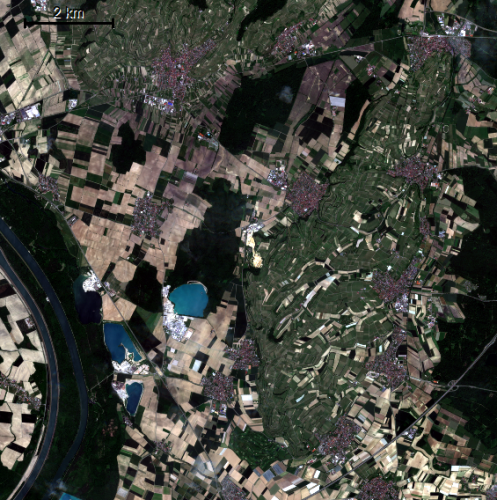
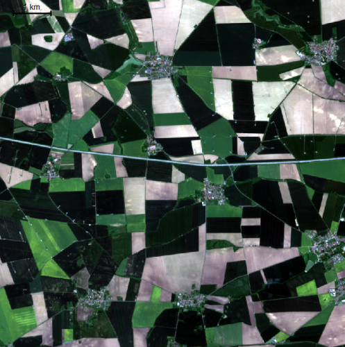
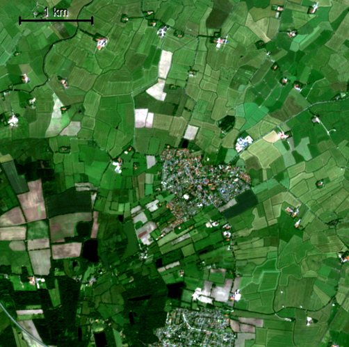

This folder provides some sample data used for setting up the algorithm and perform some preliminary evaluation on its performance. In order to achieve a high level of transferability, three different AoIs with different field structures and varying quality of the corresponding Sentinel-2 imagery (monthly composites for vegetation period) were chosen. The characteristics of the individual sample data sets are as follows:

* upper rhine area
    * AoI: ~120km2, variety of field sizes, mixed use, mostly arable farming
    * S-2 data: 6 months (Apr-Sep), cloudfree
* magdeburger boerde
    * AoI: ~85km2, large field sizes, exclusively arable farming
    * S-2 data: 7 months (Mar-Oct, excl. July), partly slightly cloudy
* coastal landscape
    * AoI: ~25km2, mostly meadows, in some parts delineated by bushes
    * S-2 data: 5 months (June-Oct), cloudfree

Sentinel-2 imagery (June 2021) for each of the sample data sets alongside with centroid coordinates: 

<table width="100%" cellspacing="5" cellpadding="1" border="0">
	<tbody>
		<tr>
		<td valign="top" align="center" width=30%>
             
            <i>
                upper rhine 
                7.67°E 48.00°N 
                <a href="https://www.google.at/maps/@48,7.67,12000m/data=!3m1!1e3?hl=en">view on google maps</a>   
            </i>
        </td>
		<td valign="top" align="center" width=30%>
             
            <i>
                magdeburger boerde 
                11.34°E 52.19°N 
                <a href="https://www.google.at/maps/@52.19,11.34,10000m/data=!3m1!1e3?hl=en">view on google maps</a>  
            </i>
        </td>
		<td valign="top" align="center" width=30%>
             
            <i>
                coastal landscape 
                7.98°E 53.57°N 
                <a href="https://www.google.at/maps/@53.57,7.98,6000m/data=!3m1!1e3?hl=en">view on google maps</a>
            </i>
        </td>
		</tr>
	</tbody>
</table>

<!-- 
Note that the decription may be complemented by providing an interactive leaflet map, which could be integrated in the following manner. Iframe-Tag is not allowed for github markdowns but via embed the map could be displayed:
<embed type="text/html" src="https://fkroeber.de/wp-content/uploads/2022/06/study_area_map.html" width="500" height="200">    -->

Note that the transferability of the algorithm is thus still only tested in the context of certain climates and agricultural systems. The extent to which it can be applied beyond the areas presented here - all located in temperate mid-latitudes (Koeppen-Geiger: Cfb & Dfb) - has not been explicitly investigated yet.

For each of the selected AoIs, training and validation fields have been delineated manually using very high-resolution imagery. As their date of recording not always coincided with that of the S2 scenes (i.e. recording date differ from 2021), the Sentinel-2 composites themselves were used to support manual field boundary delineation. Every AoI is accompained by a subfolder containing the following vector data sets:
* train10
* train20
* validation

Two training data sets are available in order to evaluate the sensitivity of the algorithm to the specific fields selected for parameter optimisation. By providing different number of fields for each training data set it should be possible to get a feel for the required number of fields necessary for achieving certain level of delineation accuracy. Both training data sets were created by choosing fields within the AoI manually in a way that aims at covering the variety of field sizes, field shapes, crop types and surroundings. Results obtained based on the basis of the two training sets can then be assessed using the validation data set containing 30 fields selected based on random sampling in order to avoid biases in the selection of fields. Even though stratified sampling would be considered superior, it was not feasible to perform this due to missing crop classifications.

Note the following things with regard to the selection of training & validation polygons:
* Validation measures should only be considered indicative due to the small sample size.
* Explicit contol of the field delineation process by unrepresentative selection of trainiung fields was not further tested. Instead the 10 or 20 training parcels were selected in manner to be representative for all fields in the corresponding AoI as explained above. Nevertheless, the specific selction of certain field types/structures remains an intended capability of the current algorithm which needs further evaluation in a follow up study. 

The following study site specific remarks are to be made:
* upper_rhine: partly permanent cultures with complicated parcel structure
* magdeburger_boerde: in most cases clearly seperated field, should obtain best results 
* coastal: transition between meadows difficult to determine, single tree groups & weakly visible channel structures complicate field boundary delineation even for a human interpreter